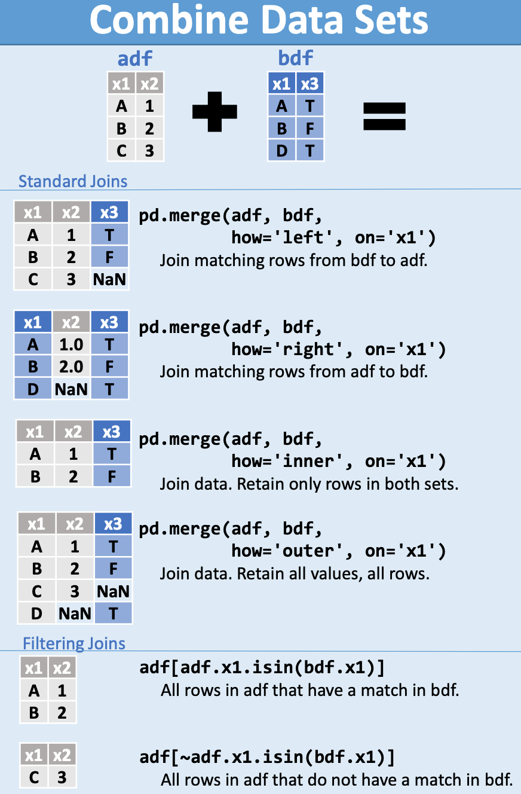
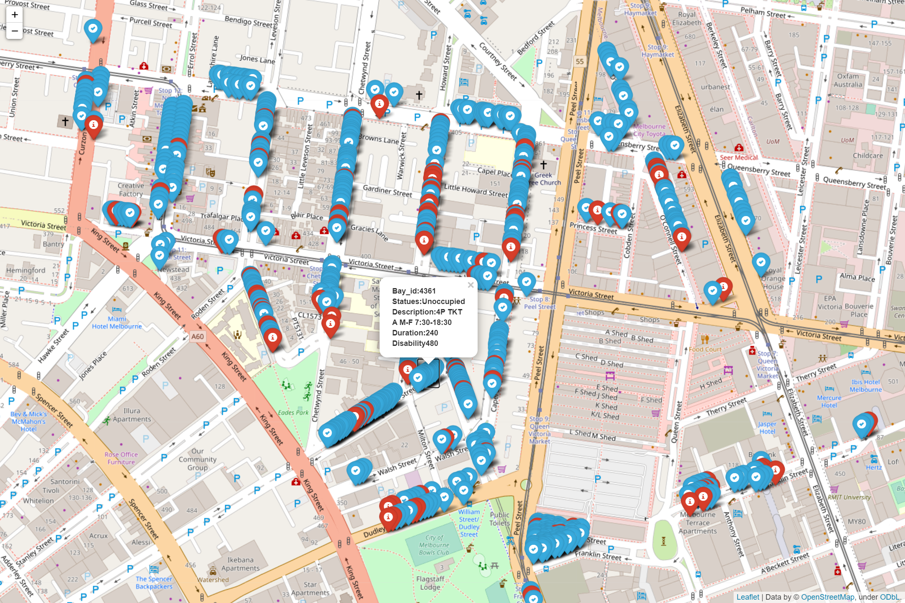

**Melbourne Open Data**
=========================

__Author__: Oscar, Mirriam, Albert

__Deakin University__ 

__T2/2021__

.


----
# About Melbourne Data

Welcome to Melbourne Data - the City of Melbourne’s open data platform, where you can access and use a wide variety of publicly accessible council data. By publishing this data, we aim to increase transparency, improve public services and support new economic and social initiatives.
We would love to see how you’re using our data.

* Example Dataset: [On-street Parking Bay Sensors](https://data.melbourne.vic.gov.au/Transport/On-street-Parking-Bay-Sensors/vh2v-4nfs) 

* Machine Language: Python

* [App Token](https://dev.socrata.com/docs/app-tokens.html) (Optional)

* Package Need: `$1, $2, $3`

* Perquisite knowledge: `add something...`
* `Add more desciption (oscar)`  
  


---


Summary Table for Open Data
=====


| Name  | id |  updatead_At  |createAt |downloadCount |
| :---        |    :----:   |          ---: |       ---: |       ---: |
Postcodes|m7yp-p495|2020-02-25T02:19:56.000Z|2014-06-26T06:28:18.000Z|13530346
On-street Parking Bay Sensors|vh2v-4nfs|2021-08-05T03:25:30.000Z|2017-08-10T04:57:59.000Z|12074388
Street names|2x56-ai8r|2021-08-04T16:45:52.000Z|2015-04-14T04:36:39.000Z|9808179
Small Areas for Census of Land Use and Employment (CLUE)|gei8-3w86|2020-02-24T02:09:59.000Z|2014-05-02T08:02:19.000Z|7362378
Road corridors|9mdh-8yau|2021-08-04T16:43:58.000Z|2014-06-26T06:31:25.000Z|7206912
City Circle tram stops|dh3m-ckxm|2020-04-05T21:42:05.000Z|2014-06-26T05:24:08.000Z|6644363
Former lakes and wetlands in Melbourne|n6sz-6nb6|2020-02-24T02:10:11.000Z|2014-07-09T05:04:14.000Z|5564262
Soil textures at various depths|svux-bada|2020-02-24T02:10:26.000Z|2014-07-09T05:06:20.000Z|5415168
Garbage collection zones|dmpt-2xdw|2021-08-04T16:39:19.000Z|2015-09-23T23:16:36.000Z|5049596
Municipal boundary|ck33-yh8z|2020-02-24T02:10:15.000Z|2014-06-26T06:11:47.000Z|5013334

---

Knowledge Refreshing: 
=======================

According to __Codecademy__, we give some description:

During your brainstorming phase, you should consider two things:

1. The focusing question you want to answer with your chart.
2. The type of data that you want to visualize
   
Depending on the focusing questions you’re trying to answer, the type of chart you select should be different and intentional in its difference. 

In the diagram below, we have assigned Matplotlib visualizations to different categories. These categories explore common focusing questions and types of data you may want to display in a visualization:


---


## 1. Reading dataset

`Oscar has worked up here:`

>replace this section with new function. 
Showing summary table of 222 datasets


```python
>>> from sodapy import Socrata
>>> client = Socrata(
        "sandbox.demo.socrata.com",
        "FakeAppToken",
        username="fakeuser@somedomain.com",
        password="mypassword",
        timeout=10
    )
```

* [Click here]() to see how to apply **App Token**
* [Click here]() to see how to use our function to get summaized overview dataset
* [Clcik here]() ....
* ....
* ....


---
## 2. Manipulation

* [Click here] to see [example code](example.ipynb) for **Data Description**.


---



`Mirriam is working here`

>Create EDA Code:
Plz create file with your EDA code.
Do not merge your code into **example.ipynb** file)


## 3. Analysis  

* [Click here](EDA.ipynb) to see example code for **EDA**

`Mirriam is working here`

Open the link ["Geo_Map.html"](Geo_Map.html) with your browser to check the parking status. 

Different colored icons are used to distinguish the availability of parking Spaces.Red means the parking space is occupied, and blue means the parking space is available. 

When you select a specific icon, you can see the specific status of the parking space.
Bay_id:The unique ID of the parking bay where the parking sensor is located.If you encounter any situation on the street, the Bay ID will be able to quickly locate you.
Status:The status will either display: Occupied – A car is present in the parking bay at that time. Unoccupied – The parking bay is available at that time.Help you quickly find available parking.
Description:A compact, semi-human-readable description of the overall restrictions.If you're interested in free parking time, then this is perfect for you.
Duration:The time (in minutes) that a vehicle can park at this location.
Disability:For bays that aren't limited to disabled permits, how much time (minutes) a vehicle with disabled permit can spend in the spot. Usually twice the regular amount of time.

The screenshot below:




